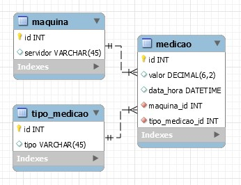
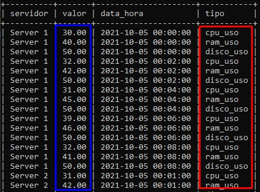
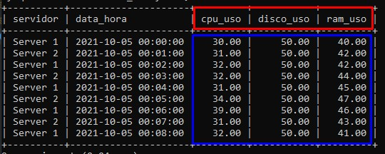
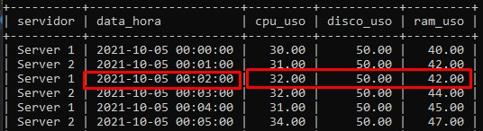

# Pivot

## Criando ambiente

Modelagem de auxílio:

Para recriar o banco dessa prática basta executar o arquivo **create-db.sql**. Este arquivo contém tanto a criação das tabelas quanto a inserção dos dados.

## Pivot

Para facilitar o pivot, vamos criar uma **view** que abstraia um inner join entre as 3 tabelas da modelagem (e descartar seus ids). Chamaremos essa view de **v_inner_join**:

~~~sql
CREATE OR REPLACE VIEW v_inner_join AS
SELECT maquina.servidor, valor, data_hora, tipo_medicao.tipo FROM 
maquina INNER JOIN medicao ON maquina.id = medicao.fk_maquina
INNER JOIN tipo_medicao ON medicao.fk_tipo_medicao = tipo_medicao.id;
~~~

Preparando o comando do Pivot e guardando seu resultado em uma view chamada **v_analytics**:

~~~sql
SET @sql = CONCAT('CREATE OR REPLACE VIEW v_analytics AS SELECT servidor, data_hora, ', 
(SELECT GROUP_CONCAT(DISTINCT CONCAT('max(case when tipo = ''', tipo, ''' then valor end) ', 
tipo)) FROM v_inner_join), ' FROM v_inner_join GROUP BY data_hora ORDER BY data_hora ASC');
~~~

>**tipo** -> após o pivot, os valores da coluna **tipo** se tornarão novas colunas.

>**valor** -> após o pivot, os valores da coluna **valor** serão registros das novas colunas.

Executando o pivot:

~~~sql 
PREPARE stmt FROM @sql;
EXECUTE stmt;
DEALLOCATE PREPARE stmt;
~~~

Pronto. Agora basta fazer um select na view v_analytics:

~~~sql
SELECT * FROM v_analytics;
~~~

## Comparando views

Sem pivot:

Com pivot:

## Observações

1) É importante que os valores da coluna **tipo** não contenham espaços vazios.

>    ✅ "uso_cpu"
>
>    ❌ "uso cpu"

2) Para garantir que os dados estejam agrupados de forma correta e evitar o aparecimento de valores nulos, é necessário que exista uma coluna com um valor em comum entre diferentes medições.

    Note como as três medições estão atreladas à uma mesma data:

    